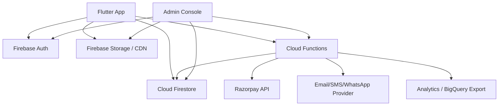

# Vastrax Architecture

This document defines the end-to-end architecture for Vastrax going forward. It assumes the current Flutter app remains collection-first, with Firebase as the primary backend and Razorpay as the payment provider.

The goal is to keep the first production version fast to ship while using data shapes, security rules, and app boundaries that can scale into authenticated users, inventory control, orders, admin operations, and analytics.

## 1. Product Direction

Vastrax is a premium collection-driven commerce app. The product experience should lead with drops and storytelling, then let users browse products, inspect details, add variants to cart, check out, track orders, and return for new collection launches.

Primary users:

- Guest shopper: browses collections, adds to cart, checks out with phone/email.
- Signed-in shopper: saves addresses, wishlists, carts, and sees order history.
- Admin/ops user: manages products, collections, stock, orders, promotions, and content.

Core product principles:

- Collections are first-class entities, not only product tags.
- Product variants carry sellable inventory; products are the presentation layer.
- Orders snapshot all product, price, tax, shipping, and address information at purchase time.
- Payment verification, stock reservation, and order status transitions happen server-side.
- Client reads are optimized for storefront screens and never require fetching the whole catalog.

## 2. High-Level System



Recommended stack:

| Layer | Choice |
| --- | --- |
| Mobile/Web | Flutter |
| State | Provider now, Riverpod later if state complexity grows |
| Routing | go_router |
| Auth | Firebase Auth, phone OTP first, email/social optional |
| Database | Cloud Firestore |
| Media | Firebase Storage behind CDN/cached_network_image |
| Backend | Cloud Functions for Firebase |
| Payments | Razorpay Orders + Webhooks |
| Notifications | FCM, plus transactional email/SMS provider |
| Analytics | Firebase Analytics, Crashlytics, Performance, BigQuery export |
| Admin | Flutter web admin or internal Next.js/React admin |

## 3. App Module Architecture

Use feature-first modules and keep Firebase code behind repositories/services.

```text
lib/
  core/
    app.dart
    config/
      env.dart
      firebase_options.dart
    constants/
      routes.dart
      firestore_paths.dart
    errors/
      app_exception.dart
      failure.dart
    routing/
      app_router.dart
      route_guards.dart
    services/
      analytics_service.dart
      crash_service.dart
      connectivity_service.dart
      remote_config_service.dart
    theme/
    utils/
    widgets/

  features/
    auth/
      data/
      domain/
      presentation/
    product/
      data/
      domain/
      presentation/
    collection/
      data/
      domain/
      presentation/
    cart/
      data/
      domain/
      presentation/
    checkout/
      data/
      domain/
      presentation/
    order/
      data/
      domain/
      presentation/
    profile/
      data/
      domain/
      presentation/
    wishlist/
    search/
    admin/
```

Each feature should follow:

- `domain/models`: immutable models with `fromFirestore`, `toFirestore`, and derived getters.
- `data/repositories`: Firestore queries, Cloud Function calls, caching decisions.
- `presentation/providers`: screen state, loading/error states, form state.
- `presentation/screens`: layout and navigation only.
- `presentation/widgets`: reusable feature widgets.

Repository rules:

- Screens do not call Firestore directly.
- Repositories return typed models or result objects.
- Writes that affect money, stock, orders, or payment status go through Cloud Functions.
- Client-side writes are allowed for low-risk user-owned data such as wishlist, cart drafts, and addresses.

## 4. Firestore Data Model

Use lower-case plural collection names. Use Firestore document IDs as stable IDs. Store `createdAt`, `updatedAt`, and `schemaVersion` on all major documents.

### 4.1 `collections/{collectionId}`

Represents a brand drop/theme such as `prithvi-dhaga`, `rudra`, or `aatma`.

```js
{
  id: "prithvi-dhaga",
  slug: "prithvi-dhaga",
  title: "Prithvi & Dhaga",
  subtitle: "Earth weave craft...",
  mood: "Earth Weave / First Drop",
  signature: "Rooted textile, antique gold...",
  story: "Long-form drop story...",
  status: "published", // draft | scheduled | published | archived
  launchAt: Timestamp,
  sortOrder: 10,

  heroImage: {
    url: "https://...",
    storagePath: "collections/prithvi-dhaga/hero.jpg",
    alt: "Prithvi collection hero"
  },
  gallery: [
    { url: "https://...", storagePath: "...", alt: "...", sortOrder: 1 }
  ],

  palette: {
    primary: "#10221A",
    secondary: "#745135",
    accent: "#D59A5C",
    colors: ["#10221A", "#75512F", "#D19A5D", "#0A1320"]
  },

  seo: {
    title: "Prithvi & Dhaga Collection",
    description: "...",
    imageUrl: "https://..."
  },

  metrics: {
    productCount: 12,
    availableProductCount: 9,
    minPrice: 89900,
    maxPrice: 579900
  },

  createdAt: Timestamp,
  updatedAt: Timestamp,
  publishedAt: Timestamp,
  schemaVersion: 1
}
```

Why this shape:

- Collection pages can render from one document.
- Product listing queries can filter by `collectionIds`.
- Visual theming is backend-driven instead of hard-coded in Flutter.

### 4.2 `products/{productId}`

Represents a storefront product, not a sellable unit. The sellable unit is the variant.

```js
{
  id: "rudra-flame-high-top",
  slug: "rudra-flame-high-top",
  skuBase: "VX-RUD-SNK-001",
  name: "Rudra Flame High-Top",
  subtitle: "Flame panel upper",
  description: "Full product copy...",
  shortDescription: "Charred red high-top sneaker...",

  status: "active", // draft | active | hidden | archived
  productType: "sneakers", // sneakers | tote | artifact | amulet | headwear | apparel
  category: "Sneakers",
  subCategory: "High Top",
  tags: ["rudra", "fire", "high-top"],
  collectionIds: ["rudra"],
  primaryCollectionId: "rudra",

  price: {
    mrp: 599900,
    sale: 579900,
    currency: "INR",
    taxInclusive: true,
    taxRateBps: 1200
  },

  images: [
    {
      url: "https://...",
      storagePath: "products/rudra-flame-high-top/1.jpg",
      alt: "Rudra Flame High-Top side view",
      sortOrder: 1,
      colorId: "ember-red"
    }
  ],

  options: [
    { name: "Size", values: ["UK 6", "UK 7", "UK 8", "UK 9", "UK 10"] },
    { name: "Color", values: ["Ember Red"] }
  ],

  variantSummary: {
    totalStock: 21,
    inStock: true,
    sizesInStock: ["UK 7", "UK 8", "UK 9"]
  },

  attributes: {
    fit: "True to size",
    material: "Leather, textile panels",
    care: "Wipe with dry cloth",
    origin: "India",
    weightGrams: 950
  },

  flags: {
    isNew: true,
    isTrending: true,
    isFeatured: false,
    isLimited: true
  },

  shipping: {
    weightGrams: 950,
    packageLengthCm: 34,
    packageWidthCm: 22,
    packageHeightCm: 13,
    shipsInDays: 3,
    codEligible: true
  },

  search: {
    keywords: ["rudra", "flame", "sneaker", "high top", "red"],
    normalizedName: "rudra flame high top"
  },

  metrics: {
    viewCount: 0,
    purchaseCount: 0,
    wishlistCount: 0
  },

  createdAt: Timestamp,
  updatedAt: Timestamp,
  schemaVersion: 1
}
```

Money is stored in paise as integers. The current app uses `double`; move to integer paise before real payments to avoid rounding issues.

### 4.3 `products/{productId}/variants/{variantId}`

Represents a purchasable SKU.

```js
{
  id: "rudra-flame-high-top-ember-red-uk-8",
  sku: "VX-RUD-SNK-001-ER-UK8",
  productId: "rudra-flame-high-top",
  optionValues: {
    size: "UK 8",
    color: "Ember Red"
  },
  barcode: null,
  status: "active", // active | hidden | discontinued

  priceOverride: null, // { mrp: 599900, sale: 549900, currency: "INR" }
  inventory: {
    stockOnHand: 8,
    reserved: 1,
    available: 7,
    lowStockThreshold: 2,
    allowBackorder: false
  },

  imageUrl: "https://...",
  sortOrder: 30,
  createdAt: Timestamp,
  updatedAt: Timestamp,
  schemaVersion: 1
}
```

Keep inventory on variants because size/color stock changes independently. Mirror `variantSummary` on the product for fast listing.

### 4.4 `users/{userId}`

Created after first sign-in or guest-to-account conversion.

```js
{
  id: "firebaseUid",
  role: "customer", // customer | admin | ops | support
  displayName: "Shivam Sharma",
  phoneNumber: "+91...",
  email: "user@example.com",
  photoUrl: null,
  authProviders: ["phone"],

  preferences: {
    currency: "INR",
    language: "en",
    marketingOptIn: true,
    sizeProfile: {
      footwear: "UK 8",
      apparelTop: "M"
    }
  },

  metrics: {
    orderCount: 0,
    lifetimeSpend: 0,
    lastOrderAt: null
  },

  createdAt: Timestamp,
  updatedAt: Timestamp,
  lastSeenAt: Timestamp,
  schemaVersion: 1
}
```

### 4.5 `users/{userId}/addresses/{addressId}`

```js
{
  id: "addr_...",
  label: "Home",
  fullName: "Shivam Sharma",
  phoneNumber: "+91...",
  line1: "House / flat / street",
  line2: "Area / landmark",
  city: "Mumbai",
  state: "Maharashtra",
  postalCode: "400001",
  country: "IN",
  geo: {
    lat: null,
    lng: null,
    geohash: null
  },
  isDefault: true,
  createdAt: Timestamp,
  updatedAt: Timestamp
}
```

### 4.6 `users/{userId}/carts/current`

Use this for signed-in users and cross-device persistence. Guest carts can stay local until checkout/sign-in.

```js
{
  id: "current",
  userId: "firebaseUid",
  items: [
    {
      productId: "rudra-flame-high-top",
      variantId: "rudra-flame-high-top-ember-red-uk-8",
      sku: "VX-RUD-SNK-001-ER-UK8",
      name: "Rudra Flame High-Top",
      imageUrl: "https://...",
      size: "UK 8",
      color: "Ember Red",
      unitPrice: 579900,
      currency: "INR",
      quantity: 1,
      addedAt: Timestamp
    }
  ],
  pricing: {
    subtotal: 579900,
    discountTotal: 0,
    shippingTotal: 0,
    taxTotal: 62132,
    grandTotal: 579900
  },
  couponCode: null,
  updatedAt: Timestamp,
  schemaVersion: 1
}
```

Cart prices are a preview. Final prices must be recalculated by a checkout Cloud Function.

### 4.7 `orders/{orderId}`

Top-level orders allow ops/admin queries without scanning user subcollections. Include `userId` for ownership.

```js
{
  id: "VX20260502ABCD",
  orderNumber: "VX-2026-000001",
  userId: "firebaseUid_or_guest_id",
  customerType: "registered", // registered | guest
  customer: {
    name: "Shivam Sharma",
    phoneNumber: "+91...",
    email: "user@example.com"
  },

  status: "pending_payment",
  // pending_payment | payment_authorized | confirmed | packed | shipped | delivered | cancelled | refunded | failed
  paymentStatus: "pending",
  // pending | authorized | captured | failed | refunded | cod_pending
  fulfillmentStatus: "unfulfilled",
  // unfulfilled | reserved | packed | shipped | delivered | returned

  items: [
    {
      productId: "rudra-flame-high-top",
      variantId: "rudra-flame-high-top-ember-red-uk-8",
      sku: "VX-RUD-SNK-001-ER-UK8",
      name: "Rudra Flame High-Top",
      collectionId: "rudra",
      imageUrl: "https://...",
      options: { size: "UK 8", color: "Ember Red" },
      quantity: 1,
      unitPrice: 579900,
      taxRateBps: 1200,
      lineSubtotal: 579900,
      lineDiscount: 0,
      lineTax: 62132,
      lineTotal: 579900
    }
  ],

  shippingAddress: {
    fullName: "Shivam Sharma",
    phoneNumber: "+91...",
    line1: "...",
    line2: "...",
    city: "Mumbai",
    state: "Maharashtra",
    postalCode: "400001",
    country: "IN"
  },

  billingAddress: null,

  pricing: {
    currency: "INR",
    subtotal: 579900,
    discountTotal: 0,
    shippingTotal: 0,
    taxTotal: 62132,
    grandTotal: 579900
  },

  payment: {
    method: "razorpay", // razorpay | cod
    razorpayOrderId: "order_...",
    razorpayPaymentId: null,
    razorpaySignatureVerified: false,
    capturedAt: null
  },

  shipment: {
    carrier: null,
    trackingNumber: null,
    trackingUrl: null,
    shippedAt: null,
    deliveredAt: null
  },

  notes: {
    customer: null,
    internal: null
  },

  source: {
    platform: "ios", // ios | android | web
    appVersion: "1.0.0+1",
    campaign: null
  },

  createdAt: Timestamp,
  updatedAt: Timestamp,
  confirmedAt: null,
  cancelledAt: null,
  schemaVersion: 1
}
```

### 4.8 `orders/{orderId}/events/{eventId}`

Append-only audit trail.

```js
{
  type: "payment_captured",
  message: "Razorpay payment captured",
  actorType: "system", // system | customer | admin | razorpay
  actorId: "function:createOrder",
  metadata: {
    razorpayPaymentId: "pay_..."
  },
  createdAt: Timestamp
}
```

### 4.9 `wishlists/{userId}`

```js
{
  userId: "firebaseUid",
  productIds: ["rudra-flame-high-top"],
  updatedAt: Timestamp
}
```

For very large wishlists, switch to `users/{userId}/wishlistItems/{productId}`. For the expected early scale, one document is efficient.

### 4.10 `promotions/{promotionId}`

```js
{
  code: "FIRSTDROP",
  title: "First Drop Offer",
  status: "active", // draft | active | expired | disabled
  type: "percentage", // percentage | fixed | free_shipping
  value: 1000, // bps for percentage, paise for fixed
  minSubtotal: 300000,
  maxDiscount: 50000,
  currency: "INR",
  startsAt: Timestamp,
  endsAt: Timestamp,
  usageLimit: 1000,
  usageCount: 0,
  perUserLimit: 1,
  eligibleCollectionIds: ["rudra"],
  eligibleProductIds: [],
  createdAt: Timestamp,
  updatedAt: Timestamp
}
```

Promotion validation must happen in Cloud Functions.

### 4.11 `inventoryReservations/{reservationId}`

Used during checkout to prevent overselling.

```js
{
  orderId: "VX20260502ABCD",
  userId: "firebaseUid",
  status: "active", // active | consumed | released | expired
  expiresAt: Timestamp,
  items: [
    {
      productId: "rudra-flame-high-top",
      variantId: "rudra-flame-high-top-ember-red-uk-8",
      quantity: 1
    }
  ],
  createdAt: Timestamp,
  updatedAt: Timestamp
}
```

Reservations are created in a transaction when a Razorpay order is created. A scheduled function releases expired reservations.

### 4.12 `contentPages/{pageId}`

For static commerce content.

```js
{
  slug: "shipping-policy",
  title: "Shipping Policy",
  bodyMarkdown: "...",
  status: "published",
  updatedAt: Timestamp
}
```

### 4.13 `appConfig/storefront`

```js
{
  maintenanceMode: false,
  minimumSupportedVersion: {
    ios: "1.0.0",
    android: "1.0.0"
  },
  featuredCollectionIds: ["prithvi-dhaga", "rudra", "aatma"],
  homeSections: [
    { type: "collection_carousel", title: "Drops", collectionIds: ["rudra"] },
    { type: "product_grid", title: "Trending", query: "trending" }
  ],
  freeShippingThreshold: 0,
  codEnabled: true,
  razorpayEnabled: true,
  updatedAt: Timestamp
}
```

## 5. Firestore Query Strategy

Home screen:

- Read `appConfig/storefront`.
- Query `collections` where `status == published`, ordered by `sortOrder`.
- Query `products` where `flags.isTrending == true` and `status == active`, limit 10.

Collection detail:

- Read `collections/{collectionId}`.
- Query `products` where `collectionIds array-contains collectionId` and `status == active`, ordered by `sortOrder` or `createdAt`.

Product detail:

- Read `products/{productId}`.
- Read `products/{productId}/variants` where `status == active`, ordered by `sortOrder`.
- Optionally query related products by `primaryCollectionId`.

Search:

- Phase 1: keyword array query with `search.keywords array-contains`.
- Phase 2: Algolia/Typesense when catalog grows beyond simple filters.

Orders:

- Customer: query `orders` where `userId == uid`, ordered by `createdAt desc`.
- Admin: query by `status`, `paymentStatus`, `fulfillmentStatus`, or date ranges.

## 6. Required Firestore Indexes

Create composite indexes early:

| Collection | Query | Index |
| --- | --- | --- |
| `collections` | published collections | `status ASC, sortOrder ASC` |
| `collections` | scheduled launches | `status ASC, launchAt DESC` |
| `products` | collection listing | `collectionIds ARRAY, status ASC, sortOrder ASC` |
| `products` | category listing | `category ASC, status ASC, sortOrder ASC` |
| `products` | new arrivals | `flags.isNew ASC, status ASC, createdAt DESC` |
| `products` | trending | `flags.isTrending ASC, status ASC, metrics.purchaseCount DESC` |
| `orders` | user order history | `userId ASC, createdAt DESC` |
| `orders` | ops queue | `status ASC, createdAt DESC` |
| `orders` | fulfillment queue | `fulfillmentStatus ASC, createdAt DESC` |
| `inventoryReservations` | expiry job | `status ASC, expiresAt ASC` |
| `promotions` | active code lookup | `code ASC, status ASC` |

Avoid broad unbounded reads. Every listing should use `limit`, pagination cursors, or both.

## 7. Security Rules Direction

Principles:

- Public users can read only published storefront data.
- Users can read/write only their own profile, addresses, cart, and wishlist.
- Users can create checkout attempts only through Cloud Functions, not direct order writes.
- Admin users are authorized through custom claims and can manage catalog/order data.
- Payment and inventory fields are server-owned.

Rule outline:

```js
rules_version = '2';
service cloud.firestore {
  match /databases/{database}/documents {
    function signedIn() {
      return request.auth != null;
    }

    function isOwner(userId) {
      return signedIn() && request.auth.uid == userId;
    }

    function isAdmin() {
      return signedIn() && request.auth.token.role in ['admin', 'ops'];
    }

    match /collections/{id} {
      allow read: if resource.data.status == 'published' || isAdmin();
      allow write: if isAdmin();
    }

    match /products/{id} {
      allow read: if resource.data.status == 'active' || isAdmin();
      allow write: if isAdmin();

      match /variants/{variantId} {
        allow read: if get(/databases/$(database)/documents/products/$(id)).data.status == 'active' || isAdmin();
        allow write: if isAdmin();
      }
    }

    match /users/{userId} {
      allow read, create, update: if isOwner(userId) || isAdmin();
      allow delete: if isAdmin();

      match /addresses/{addressId} {
        allow read, write: if isOwner(userId) || isAdmin();
      }

      match /carts/{cartId} {
        allow read, write: if isOwner(userId);
      }
    }

    match /wishlists/{userId} {
      allow read, write: if isOwner(userId);
    }

    match /orders/{orderId} {
      allow read: if isAdmin() || (signedIn() && resource.data.userId == request.auth.uid);
      allow create, update, delete: if isAdmin();

      match /events/{eventId} {
        allow read: if isAdmin() || (signedIn() && get(/databases/$(database)/documents/orders/$(orderId)).data.userId == request.auth.uid);
        allow write: if isAdmin();
      }
    }

    match /promotions/{id} {
      allow read: if resource.data.status == 'active' || isAdmin();
      allow write: if isAdmin();
    }

    match /appConfig/{id} {
      allow read: if true;
      allow write: if isAdmin();
    }
  }
}
```

Final production rules should validate field-level changes more strictly, especially for user documents and carts.

## 8. Cloud Functions

Use callable functions for app-initiated business workflows and HTTPS endpoints for payment webhooks.

### 8.1 `createCheckout`

Input:

```js
{
  items: [{ productId, variantId, quantity }],
  shippingAddress,
  couponCode,
  paymentMethod, // razorpay | cod
  platform,
  appVersion
}
```

Responsibilities:

- Validate auth or create guest identity.
- Fetch products and variants.
- Validate product status and variant availability.
- Recalculate prices, tax, discounts, and shipping.
- Create inventory reservation transactionally.
- Create order with `pending_payment` or `confirmed` for COD.
- Create Razorpay order for prepaid checkout.
- Return order ID, order summary, and Razorpay order payload.

### 8.2 `verifyPayment`

Input:

```js
{
  orderId,
  razorpayOrderId,
  razorpayPaymentId,
  razorpaySignature
}
```

Responsibilities:

- Verify Razorpay signature.
- Confirm payment status with Razorpay API.
- Mark order `confirmed`.
- Consume inventory reservation.
- Decrement stock.
- Create order event.
- Trigger confirmation notifications.

### 8.3 `razorpayWebhook`

Responsibilities:

- Verify webhook signature.
- Idempotently process payment captured, failed, refunded events.
- Reconcile order state if client never returns after payment.

### 8.4 `releaseExpiredReservations`

Scheduled every 5-10 minutes:

- Find active reservations where `expiresAt <= now`.
- Release reserved inventory.
- Mark linked order failed/expired if still pending.

### 8.5 `updateProductAggregates`

Triggered on variant writes:

- Recompute `variantSummary.totalStock`, `variantSummary.inStock`, and `sizesInStock`.
- Update product min/max prices if variant overrides are used.

### 8.6 `onOrderStatusChanged`

Triggered on order update:

- Write order event.
- Send status notification.
- Update user metrics.
- Update product purchase metrics after confirmation.

## 9. Inventory and Payment Flow

Prepaid Razorpay flow:

1. User taps Place Order.
2. App calls `createCheckout`.
3. Function validates cart, reserves inventory, creates Firestore order, creates Razorpay order.
4. App opens Razorpay checkout.
5. Razorpay returns payment result to app.
6. App calls `verifyPayment`.
7. Function verifies signature, captures/reconciles payment, decrements stock, confirms order.
8. Webhook also listens and idempotently confirms if the app is interrupted.

COD flow:

1. User taps Place Order with COD.
2. App calls `createCheckout`.
3. Function validates cart and checks COD eligibility.
4. Function decrements or reserves inventory depending on ops preference.
5. Order status becomes `confirmed`, payment status `cod_pending`.

Idempotency:

- `createCheckout` accepts a client-generated `checkoutAttemptId`.
- Duplicate calls with the same `checkoutAttemptId` return the same order if the first succeeded.
- Webhooks store processed event IDs under `paymentEvents/{eventId}`.

## 10. Screens and Navigation

### 10.1 Customer App Screens

| Route | Screen | Purpose | Data |
| --- | --- | --- | --- |
| `/splash` | SplashScreen | Load config, auth state, feature flags | `appConfig/storefront`, auth |
| `/home` | HomeScreen | Collection-first storefront | published collections, featured products |
| `/collection/:id` | CollectionDetailScreen | Drop story and products | collection doc, product list |
| `/product/:id` | ProductDetailScreen | Gallery, variants, details, add to cart | product doc, variants |
| `/search` | SearchScreen | Search and filters | products query/search service |
| `/wishlist` | WishlistScreen | Saved products | wishlist + product refs |
| `/cart` | CartScreen | Cart review and quantity changes | local/provider cart, optional Firestore cart |
| `/checkout/address` | CheckoutAddressScreen | Address selection/input | user addresses |
| `/checkout/payment` | CheckoutPaymentScreen | Price review and payment method | checkout quote |
| `/checkout/processing` | PaymentProcessingScreen | Razorpay handoff/loading | checkout attempt |
| `/order/success/:id` | OrderSuccessScreen | Confirmation | order doc |
| `/orders` | OrdersScreen | Order history | orders by user |
| `/orders/:id` | OrderDetailScreen | Tracking, support, invoice | order + events |
| `/profile` | ProfileScreen | Account details and preferences | user doc |
| `/addresses` | AddressBookScreen | Manage addresses | user addresses |
| `/auth/phone` | PhoneAuthScreen | OTP login/signup | Firebase Auth |
| `/content/:slug` | ContentPageScreen | Policies and support content | contentPages |

### 10.2 Admin Screens

Admin can be a protected Flutter web app under `/admin` or a separate app.

| Screen | Purpose |
| --- | --- |
| AdminDashboard | Sales, orders, stock warnings, drop status |
| CollectionList | Manage drops, status, launch dates |
| CollectionEditor | Palette, story, hero, gallery, sort order |
| ProductList | Catalog management with filters |
| ProductEditor | Product details, media, collections, SEO |
| VariantEditor | SKU, options, stock, pricing overrides |
| Inventory | Stock adjustments and reservation visibility |
| OrdersQueue | Payment/fulfillment status queues |
| OrderDetailAdmin | Order timeline, status changes, notes, refunds |
| Promotions | Coupon creation and usage |
| ContentPages | Policy/support page editing |
| Users | Customer lookup and support context |
| Settings | Storefront config, payment toggles, shipping rules |

Admin writes should go through admin-only repositories. High-risk actions such as refunds, manual stock adjustment, and order cancellation should call Cloud Functions so events are audited consistently.

## 11. Client State Management

Current Provider setup is acceptable for the next phase. Organize providers by feature:

- `AuthProvider`: auth state, user profile, role.
- `StorefrontProvider`: app config and home sections.
- `CollectionProvider`: collection list and active collection cache.
- `ProductProvider`: product queries, product detail cache, variant cache.
- `CartProvider`: local cart, Firestore cart sync, cart totals.
- `CheckoutProvider`: address, quote, create checkout, Razorpay result.
- `OrderProvider`: order history and order detail streams.
- `WishlistProvider`: wishlist state.

Provider state shape should include:

```dart
enum LoadState { idle, loading, success, empty, error }
```

Use explicit states instead of only boolean loading flags so screens can render empty and error states cleanly.

## 12. Data Caching and Offline Behavior

Enable Firestore offline persistence where supported.

Caching approach:

- Collections and app config: cache aggressively, refresh on app launch.
- Product listings: cache paginated query results, refresh on screen open.
- Product detail: cache product and variants, but revalidate inventory before checkout.
- Cart: keep guest cart in local storage, sync signed-in cart to Firestore.
- Orders: prefer live streams for active orders, one-time reads for old orders.

Do not trust cached stock or cached prices at checkout. `createCheckout` is the source of truth.

## 13. Media Architecture

Storage paths:

```text
collections/{collectionId}/hero.{ext}
collections/{collectionId}/gallery/{imageId}.{ext}
products/{productId}/gallery/{imageId}.{ext}
products/{productId}/variants/{variantId}.{ext}
content/{pageId}/{assetId}.{ext}
```

Media document fields:

- `url`
- `storagePath`
- `alt`
- `width`
- `height`
- `blurHash` or `dominantColor`
- `sortOrder`
- `createdAt`

Use compressed responsive images for production. Keep original uploads but serve optimized images through a resize pipeline or CDN.

## 14. Analytics Events

Track these app events:

- `app_open`
- `collection_viewed`
- `collection_item_selected`
- `product_list_viewed`
- `product_viewed`
- `variant_selected`
- `add_to_cart`
- `remove_from_cart`
- `begin_checkout`
- `address_added`
- `payment_started`
- `payment_failed`
- `purchase`
- `wishlist_added`
- `search_performed`
- `filter_applied`

Event properties should include:

- `product_id`
- `variant_id`
- `collection_id`
- `price`
- `currency`
- `quantity`
- `payment_method`
- `order_id`
- `screen_name`
- `platform`

Avoid sending raw phone numbers, addresses, or other personal data to analytics.

## 15. Error Handling

Use a shared error model:

```dart
class AppException implements Exception {
  final String code;
  final String message;
  final Object? cause;
}
```

Recommended error codes:

- `network/unavailable`
- `auth/required`
- `product/not-found`
- `variant/out-of-stock`
- `cart/invalid-item`
- `checkout/price-changed`
- `checkout/payment-failed`
- `order/not-found`
- `permission/denied`

UI behavior:

- Listing errors: show retry state.
- Product unavailable: show "Notify me" or disable add to cart.
- Price changed at checkout: show updated total and require confirmation.
- Payment failed: keep order pending briefly, offer retry, and rely on webhook reconciliation.

## 16. Performance Targets

Customer app targets:

- Home first meaningful render under 1.5s on a good network.
- No collection/product listing query should read more than 20 docs initially.
- Product detail should load product and variants in parallel.
- Images should use thumbnails in grids and full-size only in detail/gallery.
- Avoid rebuilding full screens from broad providers; use smaller selectors/consumers.

Firestore efficiency:

- Denormalize collection/product summaries for list screens.
- Use `limit` and cursor pagination.
- Maintain aggregate fields with Cloud Functions.
- Avoid subcollection fan-out reads on home.

## 17. Testing Strategy

Unit tests:

- Product, variant, cart, price, and order models.
- Money calculations using integer paise.
- Checkout validation.
- Repository mapping from Firestore data.

Widget tests:

- Home screen loaded/empty/error states.
- Collection detail product grid.
- Product detail variant selection and add-to-cart disabled state.
- Cart quantity updates.
- Checkout form validation.

Integration tests:

- Browse collection to product to cart.
- Guest checkout COD.
- Razorpay test payment success/failure.
- Signed-in order history.

Backend tests:

- Firestore rules tests for public/customer/admin access.
- Cloud Function tests for stock reservation, payment verification, idempotency, and expired reservation release.

## 18. Migration From Current Code

Current state:

- Products are stored in `products`.
- Collection themes are hard-coded in `collection_theme_model.dart`.
- Cart is local Provider state.
- Checkout shows a success dialog and hard-coded order number.

Migration plan:

1. Move collection themes into Firestore `collections`.
2. Update `CollectionThemeModel` to support Firestore serialization.
3. Replace hard-coded collection list with `CollectionRepository`.
4. Convert product price from `double` rupees to integer paise.
5. Add product variants subcollection and update product detail size selector from variants.
6. Persist signed-in carts under `users/{userId}/carts/current`.
7. Add auth flow with phone OTP.
8. Replace checkout dialog with `createCheckout` Cloud Function.
9. Add Razorpay verification and webhook reconciliation.
10. Add order history and order detail screens.
11. Add admin workflows for catalog, inventory, and orders.

## 19. Implementation Phases

### Phase 1: Storefront Data Foundation

- Firestore `collections`, `products`, and `variants`.
- Repositories for collections/products.
- Home, collection detail, and product detail read from Firestore.
- Basic indexes and public read rules.
- Image URLs migrated to Firebase Storage/CDN.

### Phase 2: Cart, Auth, and Profile

- Firebase Auth phone login.
- User profile document creation.
- Address book.
- Local guest cart plus signed-in cart sync.
- Wishlist.

### Phase 3: Checkout and Orders

- Cloud Functions: `createCheckout`, `verifyPayment`, `razorpayWebhook`.
- Order documents and events.
- Inventory reservations.
- COD and Razorpay flows.
- Order success/history/detail screens.

### Phase 4: Admin and Operations

- Admin role custom claims.
- Collection/product/variant editors.
- Inventory dashboard.
- Order status management.
- Promotions.
- Content page management.

### Phase 5: Scale and Growth

- Search service integration.
- Recommendation sections.
- Push notifications.
- BigQuery dashboards.
- A/B tested home sections via Remote Config.
- Automated image optimization.

## 20. Naming and Conventions

Document IDs:

- Collections: stable slugs, for example `prithvi-dhaga`.
- Products: stable slugs, for example `rudra-flame-high-top`.
- Variants: product slug plus option suffix, or generated ID if options change often.
- Orders: generated order ID with separate human-readable `orderNumber`.

Timestamps:

- Use server timestamps for `createdAt` and `updatedAt`.
- Use UTC everywhere. Display in the user's locale.

Money:

- Store all amounts in paise.
- Store `currency` on every price object.
- Never use floating point for payment/order totals.

Status fields:

- Prefer explicit status strings.
- Keep payment, fulfillment, and order status separate.
- Update status through server functions for auditability.

## 21. Open Decisions

These choices should be finalized before production checkout:

- Whether checkout requires sign-in or supports true guest checkout.
- Whether COD reserves stock or decrements immediately.
- Which provider handles shipping rates and tracking.
- Whether admin is built in Flutter web or as a separate web app.
- Whether search stays in Firestore for launch or moves directly to Algolia/Typesense.
- Final tax/GST invoice requirements.

## 22. Definition of Done for Production Architecture

The architecture is production-ready when:

- Public reads expose only published storefront data.
- Client cannot directly write orders, stock, payment status, or product pricing.
- Payment verification is server-side and webhook-backed.
- Inventory is reserved/decremented transactionally.
- Orders snapshot all purchase-critical details.
- Admin actions are role-protected and audited.
- Core screens have loading, empty, error, and success states.
- Indexes support every storefront/admin query.
- Crash, analytics, and payment failure paths are observable.
